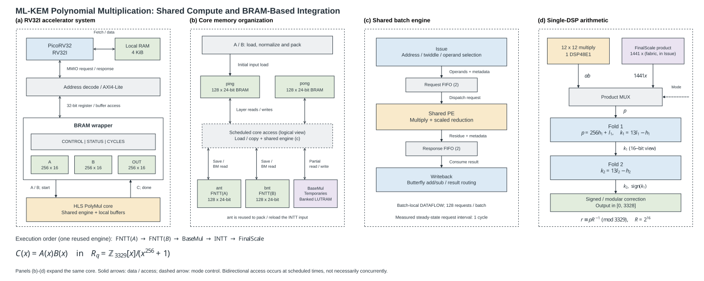

# ML-KEM PolyMul · PicoRV32 · PYNQ-Z2

本工程在 PYNQ-Z2 的 PL 端运行 PicoRV32，通过 AXI4-Lite 和 BRAM 接口驱动 ML-KEM 多项式乘法加速核。提供原始 RV32I 和 RV32IM 迭代乘法两种配置，默认仍为 RV32I。目标器件为 `xc7z020clg400-1`，板载 125 MHz 时钟经 MMCM 转为 100 MHz；工程采用纯 RTL，不使用 Zynq PS 或 Block Design。

运算为 `FNTT(A) → FNTT(B) → BaseMul → INTT → FinalScale`，计算环 `Z_3329[x]/(x^256+1)` 中的多项式乘法。这是完整 ML-KEM 算法中的运算模块。



## 快速开始

使用 **Vivado 2024.2**，安装 Zynq-7000 器件支持。克隆后可直接打开 [mlkem_pynqz2.xpr](vivado/project/mlkem_pynqz2.xpr)。如需重新生成完整工程，从仓库根目录运行：

```text
vivado -mode batch -source scripts/run.tcl -tclargs project
```

生成的完整工程位于 `vivado/project/`，打开其中的 `mlkem_pynqz2.xpr` 即可使用 GUI。默认顶层为 `mlkem_polymul_pynqz2_top`，启用只读 VIO，固件为 `firmware/images/transfer_both_unroll4.mem`。

```text
vivado -mode batch -source scripts/run.tcl -tclargs vio
vivado -mode batch -source scripts/run.tcl -tclargs implement
```

`vio` 运行板级仿真；`implement` 通过四组仿真后完成综合、布局布线和 bitstream 生成，导出烧录文件至 `release/`、报告至 `build/reports/`。工程创建和实现不会自动烧录开发板。

RV32IM 迭代乘法配置启用 PicoRV32 原有的乘除法单元（`MUL=1, FAST_MUL=0, DIV=1`），使用独立工程和输出目录：

```text
vivado -mode batch -source scripts/run.tcl -tclargs project firmware/images rv32im_iterative
vivado -mode batch -source scripts/run.tcl -tclargs cpu firmware/images rv32im_iterative
vivado -mode batch -source scripts/run.tcl -tclargs implement firmware/images rv32im_iterative
```

完整工程为 [RV32IM XPR](vivado/project_rv32im_iterative/mlkem_pynqz2.xpr)，烧录文件在 `release/rv32im_iterative/`。该配置通过 4096 项 M 指令检查、原四组回归及实现；测量表和原始证据入口见 [性能与资源数据](docs/BENCHMARKS.md)。当前 transfer 固件仍为不含 M 指令的原始 RV32I 镜像，因此系统回归用于验证兼容性；CPU-only 软件多项式 baseline 已完成，完整 FIPS 203 软件 baseline 和软件/硬件端到端加速比列入 [竞赛路线图](docs/COMPETITION_ROADMAP.md)，本轮也未烧录实体板。

## 目录

```text
rtl/          CPU、加速核、AXI/BRAM 接口、系统与板级 RTL
constraints/  PYNQ-Z2 引脚、时钟与复位约束
hls/          HLS C++ 源码、独立 C 测试与配置
firmware/     固件源码、链接脚本和四种预编译 transfer 镜像
tb/           CPU 指令、核心、板级、协议测试与周期监测器
firmware/cpu_baseline/  CPU-only 软件 NTT/BaseMul/INTT baseline
rtl/benchmark/          CPU-only 16 KiB RAM 系统
scripts/cpu_baseline/   三种 ISA/乘法配置的构建、仿真与数据采集
vivado/       Vivado 工程共享配置、完整工程与 VIO IP 配置
scripts/      工程创建、仿真、实现、固件编译与 JTAG 烧录入口
docs/         构建说明、目录职责、验证记录与性能数据表
results/      按配置保存的仿真日志、实现报告及校验记录
release/      按配置保存的 BIT 与匹配 LTX 烧录文件
build/        本地编译结果与报告（Git 忽略）
```

- [构建、仿真与烧录](docs/BUILD.md)
- [目录与维护规则](docs/STRUCTURE.md)
- [验证记录](docs/VALIDATION.md)
- [性能与资源数据表](docs/BENCHMARKS.md)
- [竞赛路线图与阶段门](docs/COMPETITION_ROADMAP.md)
- [CPU baseline 协议](docs/CPU_BENCHMARK_PROTOCOL.md)
- [保留源码哈希清单](docs/source_integrity.csv)
- [后续配置变更清单](docs/source_changes.csv)
- [第三方组件说明](THIRD_PARTY_NOTICES.md)

CPU-only 软件 baseline 的三组仿真、Vivado 2024.2 实现和 bitstream 由以下入口复现；它们不连接 PQC 加速器：

```text
python scripts/cpu_baseline/build.py
vivado -mode batch -source scripts/cpu_baseline/run.tcl -tclargs rv32i
vivado -mode batch -source scripts/cpu_baseline/run.tcl -tclargs rv32im_iterative
vivado -mode batch -source scripts/cpu_baseline/run.tcl -tclargs rv32im_fast
vivado -mode batch -source scripts/cpu_baseline/implement.tcl -tclargs rv32i
```

对另外两组执行 `implement.tcl` 时只替换最后一个配置名。`results/cpu_baseline/` 保存可审计的日志、资源/时序报告和构建哈希；`vivado/cpu_baseline_*/*.xpr` 是可直接打开的 CPU-only 工程。

版本库包含 `.xpr`、VIO `.xci` 和 `release/` 烧录文件。仿真、综合、实现缓存保留在本地，并由 Git 忽略。

初始目录整理保留了 52 个功能源码、测试及初始化文件的原始内容。阶段 2 仅对其中 4 个系统/板级封装与 TB 文件增加 CPU 参数透传，另 48 个文件保持原始哈希；变更记录于 `docs/source_changes.csv`，可运行 `./scripts/verify_sources.ps1` 核对。PicoRV32 内核、加速器、固件和约束未改动。`rtl/accelerator/` 是原有 Vitis HLS 2025.2 生成的 RTL，本工程使用 Vivado 2024.2 构建该快照，并未用 HLS 2024.2 重新生成或证明两版 HLS 输出等价。
